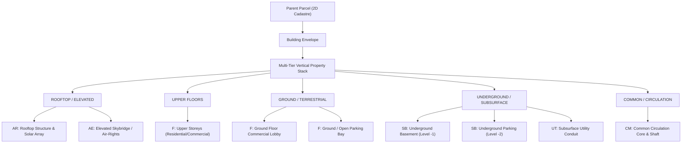

# Phase 2.8: Rich Vertical Property Decomposition & Multi-Tier 3D Property Stack

## 1. Executive Summary & Research Prototype Disclaimer

This specification documents the multi-tier vertical property decomposition model implemented for the SIH26011 research prototype ("3D ULPIN Generation and Vertical Property Mapping System").

> [!IMPORTANT]
> **RESEARCH PROTOTYPE NOTICE:**
> The identifier `{2D_ULPIN}-3D-{TIER_CODE}-{UNIT_SEQUENCE}` and associated vertical property classifications are research prototype constructs. There is no official Government of India specification for a 3D ULPIN. The prototype does not determine legal land ownership, title, leasehold boundaries, or statutory rights. All candidates remain in `PROPOSED` status until verified by authorized human roles (`LICENSED_SURVEYOR` or `REVENUE_OFFICIAL`).

---

## 2. Persisted Datasets: Baseline TOWER-A vs. Multi-Tier VERTICAL-MIXED-A

The system maintains two persisted synthetic demonstration datasets in PostgreSQL/PostGIS:

1. **`27A8B9C3D4E5F6` (TOWER-A Baseline Lifecycle Scenario)**:
   - 1 Parcel (`SYN-PLOT-42/5`), 1 Building (`TOWER-A`), 6 Vertical Units (Sequences 1–6).
   - Demonstrates the complete 4-state lifecycle (`PROPOSED`, `UNDER_REVIEW`, `VERIFIED`, `REJECTED`).
2. **`27A8B9C3D4E5F7` (VERTICAL-MIXED-A Multi-Tier Decomposition Scenario)**:
   - 1 Parcel (`SYN-PLOT-43/6`), 1 Building (`MIXED-TOWER-A`), 10 Vertical Units (Sequences 7–16).
   - Demonstrates the rich vertical decomposition across all 5 categories and 9+ strata types, including Common Circulation (`CM01`), Ground Open Parking (`P00`), and Elevated Skybridge (`AE01`).
   - All newly ingested units are strictly initialized in `PROPOSED` status with automated provenance metadata.

---

## 3. Vertical Property Taxonomy

The system decomposes heterogeneous 3D vertical spatial units into five standard strata categories:

### Strata Mapping Matrix

| Category | Tier Code | Unit Type (`unit_type_category`) | Typical Floor Code | Prototype Unit Class | Evidence Provenance Source |
| :--- | :--- | :--- | :--- | :--- | :--- |
| **UNDERGROUND** | `UT` | `UTILITY_CORRIDOR` | `UT01` | `UNDERGROUND_UTILITY` | Utility Survey / Architectural Plan 2D |
| **UNDERGROUND** | `SB` | `COMMERCIAL` / `RESIDENTIAL` | `B01` | `BASEMENT` | Structural BIM/IFC (`BIM_IFC`) |
| **UNDERGROUND** | `SB` | `PARKING` | `B02` | `UNDERGROUND_PARKING` | Structural BIM/IFC (`BIM_IFC`) |
| **GROUND** | `F` | `COMMERCIAL` / `RESIDENTIAL` | `F00` | `GROUND_FLOOR` | LiDAR Point Cloud (`LIDAR_POINTCLOUD`) |
| **GROUND** | `F` | `PARKING` | `P00` | `OPEN_PARKING` | Approved Site Plan (`ARCHITECTURAL_PLAN_2D`) |
| **UPPER_FLOORS** | `F` | `RESIDENTIAL` / `COMMERCIAL` | `F01`, `F02` | `UPPER_FLOOR` | LiDAR Point Cloud (`LIDAR_POINTCLOUD`) |
| **ROOFTOP_ELEVATED**| `AR` | `COMMON_CIRCULATION` | `RF01` | `ROOFTOP` | Drone Photogrammetry (`DRONE_PHOTOGRAMMETRY`) |
| **ROOFTOP_ELEVATED**| `AE` | `AIR_RIGHTS` | `AE01` | `ELEVATED` | Structural BIM/IFC (`BIM_IFC`) |
| **COMMON** | `CM` | `COMMON_CIRCULATION` | `CM01` | `COMMON_CIRCULATION`| Structural BIM/IFC (`BIM_IFC`) |

---

## 3. Underground Evidence Provenance Policy

Optical airborne sensors (e.g. airborne LiDAR, aerial photogrammetry) cannot penetrate the Earth's surface to directly observe subterranean spaces.
- **Underground units** (`SB`, `UT`) are strictly attributed to indoor/subsurface evidence:
  - Building Information Models (`BIM_IFC`)
  - Architectural & Sanction Plans (`ARCHITECTURAL_PLAN_2D`)
  - Subsurface Utility Surveys (`CORS_GNSS_SURVEY`, `ARCHITECTURAL_PLAN_2D`)
- Optical airborne LiDAR is never represented as detecting underground rooms, basements, tunnels, or buried utilities.

---

## 4. Geometric Solid & Validation Semantics

Every 3D unit geometry is modeled as a canonical PostGIS/SFCGAL `PolyhedralSurfaceZ` (EPSG:32644):
1. **Watertight Solid Closure**: Evaluated with `ST_IsClosed(geom_3d) = TRUE` and `CG_IsSolid(CG_MakeSolid(geom_3d)) = TRUE`.
2. **Positive Volumetric Mass**: Calculated with `CG_Volume(CG_MakeSolid(geom_3d)) > 0`.
3. **Parcel Containment**: Checked with `ST_Within(ST_Envelope(geom_3d), (SELECT geom_2d FROM parcels WHERE id = parcel_id))`.
4. **Shared Boundary Touching vs. Volumetric Collision**:
   - Boundary-touching adjacent horizontal floors meet at a 2D interface slab (`ST_3DIntersects = TRUE`), but produce **zero volumetric intersection** (`CG_Volume(CG_3DIntersection(...)) = 0.000 m³`). This is recognized as valid physical strata topology.
   - Genuine volumetric overlap (`CG_Volume(CG_3DIntersection(...)) > 0.001 m³`) is flagged as a 3D conflict requiring human cadastral review.

---

## 5. Lifecycle & Verification Rules

1. All newly generated candidate units are initialized in `PROPOSED` status.
2. `SYSTEM_VALIDATOR` automated pipelines only log `AUTO_INGESTION` or topological checks.
3. Automated tools cannot verify candidates; state transitions to `VERIFIED` strictly require an authorized human role (`LICENSED_SURVEYOR` or `REVENUE_OFFICIAL`).
4. Rejected candidates (`REJECTED`) are immutably preserved in the database audit history.
