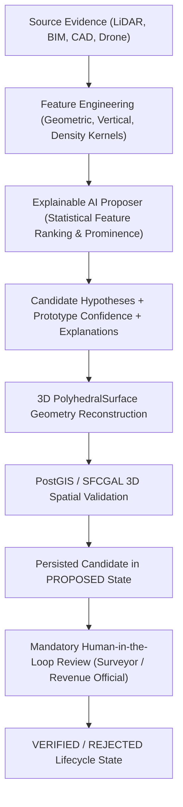

# Phase 2.9: Explainable AI-Assisted 3D Candidate Extraction

## 1. Executive Summary & Research Prototype Boundaries

This document details the **Explainable AI-Assisted 3D Candidate Extraction** engine developed for the SIH26011 research prototype ("3D ULPIN Generation and Vertical Property Mapping System").

> [!IMPORTANT]
> **RESEARCH PROTOTYPE BOUNDARY NOTICE:**
> The AI/ML system functions strictly as an **algorithmic candidate proposer** and **explainability engine**.
> 1. It is **never** a legal decision-maker and possesses **zero statutory verification authority**.
> 2. All AI candidate outputs are initialized strictly in `PROPOSED` status.
> 3. State transitions to `VERIFIED` strictly require human review by a reviewer acting in a designated prototype role (`HUMAN_REVIEWER`, `LICENSED_SURVEYOR`, or `REVENUE_OFFICIAL`). `SYSTEM_VALIDATOR` automated agents are blocked at the database and API state machine level from verifying units. Production authentication, SSO, and government identity management are outside the current research prototype scope.
> 4. Model confidence is labeled strictly as `PROTOTYPE_CANDIDATE_CONFIDENCE` (`HIGH`, `MEDIUM`, `LOW`) to explicitly distinguish heuristic spatial support from legal certainty or government title guarantee.
> 5. There is no official Government of India 3D ULPIN specification; the identifier `{2D_ULPIN}-3D-{TIER_CODE}-{UNIT_SEQUENCE}` is a research construct.

---

## 2. End-to-End Pipeline Architecture

The AI candidate extraction engine sits directly between physical/simulated spatial evidence and PostGIS/SFCGAL 3D geometry validation:

---

## 3. Feature Representation Matrix

The AI proposer computes a comprehensive feature vector `AICandidateFeatureVector` across 4 core domains:

| Domain | Feature | Type | Cadastral / Structural Significance |
| :--- | :--- | :--- | :--- |
| **Geometry** | `footprint_area_sqm` | `float` | Base surface area of horizontal stratum |
| **Geometry** | `footprint_compactness`| `float` | Isoperimetric quotient ($4\pi A / P^2$) measuring shape regularity |
| **Geometry** | `aspect_ratio` | `float` | Ratio of bounding dimensions ($\min(W,L)/\max(W,L)$) |
| **Geometry** | `centroid_x`, `centroid_y` | `float` | Spatial coordinate anchors in EPSG:32644 |
| **Vertical** | `z_min`, `z_max` | `float` | Elevation interval boundaries in meters MSL |
| **Vertical** | `height_interval_m` | `float` | Storey height ($Z_{max} - Z_{min}$) compared against architectural priors |
| **Vertical** | `relative_height_ratio`| `float` | Normalized elevation relative to total building height |
| **Point Cloud**| `point_count` | `int` | Number of observed LiDAR returns within the 3D voxel envelope |
| **Point Cloud**| `point_density_pts_m3` | `float` | Volumetric point density ($N / (A \cdot \Delta Z)$) |
| **Point Cloud**| `peak_prominence_ratio`| `float` | Structural slab density prominence relative to building baseline |
| **Point Cloud**| `z_p25`, `z_p50`, `z_p75`, `z_p90` | `float` | Elevation distribution percentiles for slab boundary verification |
| **Evidence** | `source_evidence_type` | `str` | Sensor or documentation modality (`LIDAR_POINTCLOUD`, `BIM_IFC`, etc.) |

---

## 4. Explainability & Prototype Candidate Confidence

Every generated candidate exposes human-readable, evidence-grounded rationales:

### Explainability Checklist Items
- `✓ Ground-level interface detected at elevation 540.00m (ground datum: 540.00m)`
- `✓ Strong vertical structural density peak detected (prominence ratio: 2.14x baseline)`
- `✓ Storey interval height (3.00m) conforms to standard architectural storey priors (2.7m - 3.8m)`
- `✓ Horizontal footprint demonstrates high structural regularity (compactness: 0.88)`
- `✓ Supported by structural evidence (LIDAR_POINTCLOUD)`

### Confidence Scoring Formulation
Prototype candidate confidence is computed through a multi-factor heuristic:
$$\text{Score} = w_{\text{density}} + w_{\text{height\_prior}} + w_{\text{compactness}} + w_{\text{evidence\_compatibility}}$$
- **High Confidence** ($\ge 0.75$): Strong density peak ($\ge 2.0\times$), standard storey height ($2.8\text{m} - 3.5\text{m}$), regular footprint, compatible evidence.
- **Medium Confidence** ($0.50 - 0.74$): Moderate density peak, non-critical height deviation, or slight irregularity.
- **Low Confidence** ($< 0.50$): Low density support or evidence mismatch.

---

## 5. Subterranean Safety & Underground Evidence Rule

Optical airborne sensors cannot penetrate the ground surface.
1. **Rule**: Optical airborne LiDAR (`LIDAR_POINTCLOUD`) is strictly forbidden from claiming detection of underground basements, subterranean parking, or buried utility conduits.
2. **Enforcement**: If a subterranean interval ($Z_{max} \le Z_{ground}$) is submitted with `LIDAR_POINTCLOUD`:
   - `underground_safety.is_safe` is set to `FALSE`.
   - `review_flags` appends `FLAG_REJECT_UNDERGROUND_LIDAR`.
   - Confidence is penalized to `LOW`.
   - An explanatory violation warning is generated demanding structural BIM (`BIM_IFC`) or engineering survey plans (`ARCHITECTURAL_PLAN_2D`, `CORS_GNSS_SURVEY`).

---

## 6. API Interface

### `POST /api/ai/candidates/propose`
Generates explainable 3D vertical candidate proposals directly from building extraction evidence and point clouds.

### `GET /api/vertical-units/{unit_id}/ai-analysis`
Computes on-demand AI feature vectors, explainability checklists, review flags, and prototype confidence for any persisted vertical unit.
