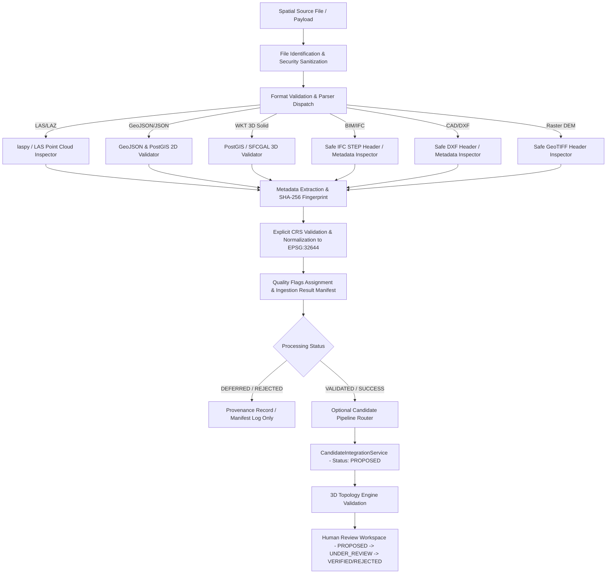

# Phase 3.3 — Real-World 3D Cadastral Data Ingestion & Source Standardization

## 1. System Context & Purpose
Phase 3.3 introduces a robust, multi-source ingestion and standardization engine for the SIH26011 3D Cadastral research prototype. Real-world 3D property mapping requires ingesting diverse, heterogeneous spatial evidence—including airborne and terrestrial LiDAR point clouds (LAS/LAZ), 2D cadastral parcel boundaries (GeoJSON), 3D PolyhedralSurface solids (WKT), Building Information Modeling (BIM/IFC), Computer-Aided Design (CAD/DXF), and Digital Elevation Models (GeoTIFF Raster DEM).

The ingestion engine is a **technical data preparation and quality-control system**. It validates geometric structure, enforces explicit Coordinate Reference Systems (CRS), computes SHA-256 source fingerprints used for provenance and reproducibility, assigns granular quality flags, and safely routes validated data into the candidate integration and human review workflow.

> [!IMPORTANT]
> **Governance Notice**:
> This research prototype provides controlled ingestion and technical processing of spatial evidence. It does not establish legal ownership, title validity, statutory approval, government certification, or an official 3D ULPIN.

---

## 2. Ingestion Pipeline Workflow

---

## 3. Supported Input Contracts & Formats

| Format Type | Input Format | Primary Purpose | Validation Engine | Processing Mode |
| :--- | :--- | :--- | :--- | :--- |
| **LiDAR Point Cloud** | ASPRS `.las` / `.laz` | Airborne / terrestrial point cloud evidence | `laspy` + Header Inspector | Bounds & Z statistics extracted; segmentation deferred |
| **2D Cadastral Boundary** | GeoJSON RFC 7946 | Terrestrial parcel boundary | PostGIS `ST_GeomFromGeoJSON` | Validated & reprojected to EPSG:32644 |
| **3D Solid Unit** | OGC WKT `POLYHEDRALSURFACE Z` | Volumetric unit solid geometry | PostGIS / SFCGAL (`CG_IsSolid`, `CG_Volume`) | Topological closure & 2-manifold volume validated |
| **BIM / Building Model** | buildingSMART `.ifc` (STEP) | Architectural & structural engineering models | ISO-10303-21 STEP Header Parser | Header & schema metadata parsed (`IFC_METADATA_ONLY`); geometry deferred |
| **CAD Drawing** | AutoCAD `.dxf` ASCII | Floor layouts & structural lines | ASCII DXF Header Parser | Section & version metadata parsed (`CAD_METADATA_ONLY`); geometry deferred |
| **Raster Elevation** | GeoTIFF `.tif` / `.tiff` (DEM/DSM) | Terrain elevation model | GeoTIFF Header Inspector | Resolution & CRS inspected; grid processing deferred |

---

## 4. CRS Handling & Standardization
- **Canonical Analytical CRS**: Projected Cartesian `EPSG:32644` (WGS 84 / UTM Zone 44N, Easting/Northing in meters).
- **Visualization CRS**: Geographic `EPSG:4326` (WGS 84 Longitude/Latitude) used for Cesium 3D globes.
- **Explicit CRS Requirement**: The system strictly forbids guessing or silently defaulting CRS when spatial geometries are provided. If a source file or payload lacks explicit CRS metadata, it is flagged with `MISSING_CRS` and rejected from coordinate transformation.
- **Z Coordinate Preservation**: All coordinate transformations strictly preserve true elevation values ($Z$ coordinates in meters above synthetic datum).

---

## 5. SHA-256 Content Fingerprinting & Provenance
- **Content Hashing**: Every ingested spatial payload or binary file is hashed using cryptographic SHA-256 (`_compute_sha256`).
- **Provenance & Integrity**: The resulting 64-character hexadecimal digest serves as a unique fingerprint for:
  1. Tracking exact source file provenance in the `source_evidence` table.
  2. Duplicate source detection (`DUPLICATE_SOURCE`).
  3. Ensuring exact reproducible processing across ingestion runs.
- **Integrity Clarification**: The SHA-256 hash is an engineering integrity check and dataset identifier; it does NOT constitute legal proof or statutory blockchain certification.

---

## 6. Structured Quality Flags
The ingestion engine assigns granular, transparent quality flags instead of an opaque score:

| Quality Flag | Tier | Description |
| :--- | :--- | :--- |
| `VALID` | INFO | Geometry and metadata passed all validation checks. |
| `VALID_POINTCLOUD` | INFO | LAS header, point count ($>0$), and bounds are valid and finite. |
| `VALID_3D_SOLID` | INFO | PolyhedralSurface is closed, 2-manifold solid with positive volume ($>0$). |
| `VALID_2D_PARCEL` | INFO | 2D Polygon is simple, valid (`ST_IsValid`), with positive area ($>0$). |
| `DEFERRED_PROCESSING` | WARNING | Recognized format whose detailed decomposition is deferred to specialized workers. |
| `SYNTHETIC_DATASET` | WARNING | Research prototype synthetic benchmark dataset. |
| `DUPLICATE_SOURCE` | WARNING | Ingested content matches an existing source evidence fingerprint. |
| `NO_UNDERGROUND_LIDAR_EVIDENCE` | INFO | Acknowledges optical LiDAR physical limits regarding underground floors. |
| `MISSING_CRS` | ERROR | Source CRS is undefined; coordinate transformation rejected. |
| `INVALID_GEOMETRY` | ERROR | Geometry contains self-intersections, open faces, or invalid topology. |
| `EMPTY_DATASET` | ERROR | File or payload contains zero points or features. |
| `NONFINITE_COORDINATES` | ERROR | Coordinate bounding box contains `NaN` or infinite values. |

---

## 7. Underground LiDAR Safety Rule
- **Physical Law**: Optical airborne LiDAR (wavelengths ~1064nm / 1550nm) reflects off top-of-canopy and ground surfaces; it does NOT penetrate solid ground or structural slabs to map underground basements or buried utility tunnels.
- **Safety Enforcement**:
  - The ingestion engine explicitly attaches the flag `NO_UNDERGROUND_LIDAR_EVIDENCE` to all LiDAR point cloud inputs.
  - Candidate unit generation strictly prohibits creating subterranean or utility tier units (`SB`, `UT`) based solely on airborne LiDAR without verified structural engineering drawings, BIM/IFC models, architectural CAD drawings, or subterranean surveys (e.g., GPR where available and appropriate).

---

## 8. Lifecycle Segregation & Governance
- **No Automatic Verification**: Ingestion NEVER creates `VERIFIED` cadastral units directly.
- **Candidate State**: Newly integrated candidates from spatial sources are created strictly in `PROPOSED` status.
- **Human Review Gate**: To advance from `PROPOSED` to `VERIFIED` or `REJECTED`, the unit must proceed through the **Human Review & Decision Workspace** (`POST /api/vertical-units/{id}/transition`) where a reviewer acting in a designated prototype role (`HUMAN_REVIEWER`, `LICENSED_SURVEYOR`, or `REVENUE_OFFICIAL`) evaluates 3D topology conflicts and evidence provenance.
- **Authentication Scope**: Production authentication, Single Sign-On (SSO), and government identity management are explicitly outside the current research prototype scope. Prototype role designations simulate the administrative review hierarchy.

---

## 9. File Security & Bounded Processing
- **Path Traversal Prevention**: Filenames are sanitized using `_sanitize_filename` (removing directory traversal sequences `../`, `..\\`, null bytes, and shell metacharacters).
- **Bounded Parsing**: Payloads are processed in memory with strict try/catch blocks to prevent malformed text or binary files from crashing the FastAPI server.
- **Safe Fallbacks**: Unsupported or heavy formats (BIM, CAD, Raster DEM) are safely parsed in `METADATA_ONLY` mode without executing untrusted external binaries.
