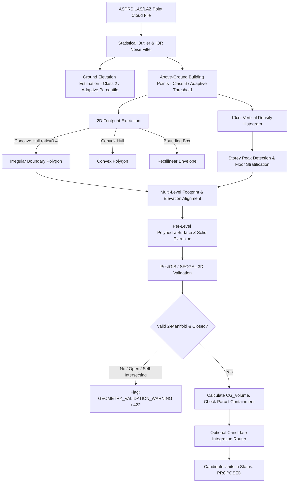

# Phase 3.4: Real-World 3D Geometry Processing & Reconstruction

## 1. Executive Summary & Research Prototype Context
Phase 3.4 introduces real-world-quality 3D geometry processing and vertical reconstruction capabilities to the SIH26011 research prototype ("3D ULPIN Generation and Vertical Property Mapping System").

> [!IMPORTANT]
> **GOVERNANCE & RESEARCH BOUNDARY NOTICE**:
> 1. This system is a **technical research prototype**.
> 2. There is no official Government of India 3D ULPIN specification. The identifier format `{2D_ULPIN}-3D-{TIER_CODE}-{UNIT_SEQUENCE}` is designated strictly as a **"Prototype 3D Unit ID"**.
> 3. The system does **not** grant legal ownership, statutory cadastral certification, title validity, or automatic legal verification.
> 4. All generated candidate units are initialized strictly in **`PROPOSED`** lifecycle status.
> 5. Airborne LiDAR cannot penetrate solid ground or structural concrete; subterranean units require validated structural drawings, BIM/CAD, or subsurface survey (GPR where available and appropriate).

---

## 2. Environment & Dependency Investigation

| Component | Verified Active Version | Status |
| :--- | :--- | :--- |
| **Operating System** | Windows (64-bit AMD64) | Active |
| **Python** | 3.11.9 | Active |
| **`laspy`** | 2.7.0 (ASPRS LAS/LAZ reader/writer) | Implemented / Active |
| **`shapely`** | 2.1.2 (2D geometric topology, concave hull, convex hull) | Implemented / Active |
| **`numpy`** | 2.4.6 (Vectorized histogramming, statistical filtering) | Implemented / Active |
| **`pydantic`** | 2.13.5 (Schema validation) | Implemented / Active |
| **`fastapi`** | 0.141.1 (REST API framework) | Implemented / Active |
| **`sqlalchemy`** | 2.0.52 & `geoalchemy2` 0.20.0 | Implemented / Active |
| **`psycopg`** | 3.3.5 (PostgreSQL binary driver) | Implemented / Active |
| **PostgreSQL** | PostgreSQL 16.15 | Active |
| **PostGIS** | PostGIS 3.6.2 | Active |
| **SFCGAL** | SFCGAL 2.2.0 (CGAL 6.0.1, BOOST 1.88.0) | Active |
| **Node.js / React** | Vite 8.2.2 / React 18 / TypeScript 5 | Active |

---

## 3. Capability Assessment & Tiering

| Capability | Scope / Engine | Decision | Architectural Rationale |
| :--- | :--- | :--- | :--- |
| **Robust Point Cloud Extraction** | `laspy` + `numpy` statistical IQR noise filter | **IMPLEMENTED** | High stability; extracts ground, roof Z, and vertical slab intervals without heavy C++ dependencies. |
| **Irregular 2D Footprints** | `shapely.concave_hull` & `convex_hull` | **IMPLEMENTED** | Replaces rigid bounding-box assumptions with genuine polygon boundaries (L-shaped, polygonal). |
| **Multi-Level Differing Footprints** | `GeometryReconstructionService` | **IMPLEMENTED** | Supports stepped podiums, tower setbacks, and cantilever overhangs per floor. |
| **Watertight Solid Extrusion** | PolyhedralSurface Z B-Rep faceted extrusion | **IMPLEMENTED** | Extrudes any closed 2D polygon into 2-manifold closed 3D solid with bottom, top, and $N$ wall facets. |
| **PostGIS / SFCGAL Validation** | `CG_IsSolid`, `CG_Volume`, `ST_IsClosed` | **IMPLEMENTED** | Reuses proven PostgreSQL 16 / SFCGAL 2.2.0 spatial validation engine. |
| **DEM / DSM Normalized Surface (nDSM)** | Raster subtraction ($DSM - DEM$) | **DEFERRED** | Requires GDAL/rasterio; deferred to keep prototype lightweight and portable. |
| **Full IFC 3D Decomposition** | IfcOpenShell volumetric worker | **DEFERRED** | Complex native C++ dependency; metadata extraction supported, full solid parsing deferred. |
| **CAD / DXF 3D Mesh Triangulation** | 3D ACIS / Polyface mesh parser | **DEFERRED** | Standard ASCII header parsing supported; mesh triangulation deferred to CAD worker. |
| **Complex Multi-Pitch Roof Fitting** | RANSAC multi-plane segmentation | **DEFERRED** | Requires high-density point clouds ($>50\text{ pts/m}^2$); flat/terraced extraction supported. |

---

## 4. Implemented Pipeline Architecture

---

## 5. Geometric Reconstruction & Extrusion Formula
For any 2D polygon boundary ring with $N$ vertices $(x_0, y_0), (x_1, y_1), \dots, (x_{n-1}, y_{n-1})$ and vertical interval $[z_{\min}, z_{\max}]$:
1. **Bottom Facet** ($Z = z_{\min}$): Oriented clockwise (normal pointing $-Z$):
   $$F_{\text{bottom}} = ((x_{n-1}, y_{n-1}, z_{\min}), \dots, (x_0, y_0, z_{\min}), (x_{n-1}, y_{n-1}, z_{\min}))$$
2. **Top Facet** ($Z = z_{\max}$): Oriented counter-clockwise (normal pointing $+Z$):
   $$F_{\text{top}} = ((x_0, y_0, z_{\max}), \dots, (x_{n-1}, y_{n-1}, z_{\max}), (x_0, y_0, z_{\max}))$$
3. **Lateral Wall Facets** ($i = 0 \dots n-1$): Quad facets spanning the elevation delta:
   $$F_{\text{wall}, i} = ((x_i, y_i, z_{\min}), (x_{i+1}, y_{i+1}, z_{\min}), (x_{i+1}, y_{i+1}, z_{\max}), (x_i, y_i, z_{\max}), (x_i, y_i, z_{\min}))$$

The resulting collection forms an exact 2-manifold closed solid:
$$\text{POLYHEDRALSURFACE Z }(F_{\text{bottom}}, F_{\text{top}}, F_{\text{wall}, 0}, \dots, F_{\text{wall}, n-1})$$

---

## 6. Endpoints Exposed in Phase 3.4

| Method | Route | Description |
| :--- | :--- | :--- |
| `POST` | `/api/geometry/extract-pointcloud` | Extracts ground, roof, irregular footprint (concave/convex hull), and vertical storeys from point clouds. |
| `POST` | `/api/geometry/reconstruct-multilevel` | Reconstructs multi-level buildings supporting differing floor footprints (podiums, setbacks, cantilevers). |
| `POST` | `/api/geometry/validate-solid` | Directly validates 3D PolyhedralSurface WKT with SFCGAL (`CG_IsSolid`, `CG_Volume`, `ST_IsClosed`). |

---

## 7. Governance, Verification, and Safety Boundaries
1. **Candidate State**: Reconstructed units are integrated strictly as `PROPOSED`.
2. **No Automatic Verification**: `SYSTEM_VALIDATOR` is strictly prohibited from granting verification. Reviewers operating in prototype roles (`HUMAN_REVIEWER`, `LICENSED_SURVEYOR`, `REVENUE_OFFICIAL`) review candidate proposals through the Human Review Workspace.
3. **Underground Safety**: Point cloud extraction explicitly attaches `NO_UNDERGROUND_LIDAR_EVIDENCE`.
