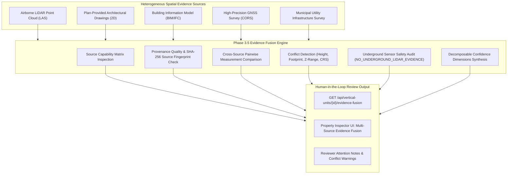

# Phase 3.5: Multi-Source Evidence Fusion & Confidence-Aware 3D Candidate Generation

## 1. Executive Summary

Phase 3.5 introduces an explainable, rule-based geospatial evidence-fusion engine for the SIH26011 3D cadastral research prototype. The system evaluates multiple independent spatial source records associated with a proposed 3D vertical unit, performs cross-source measurement comparisons, detects geometric and provenance conflicts, enforces strict underground sensor safety, and synthesizes transparent, decomposable confidence dimensions for authorized human reviewers.

> [!IMPORTANT]
> **Non-Legal Research Prototype Statement**
> Evidence confidence indicates the technical strength, consistency, and completeness of available prototype spatial datasets. It does NOT represent legal ownership certainty, statutory cadastral certification, title validity, or automated government approval. The system strictly preserves the human-in-the-loop lifecycle state machine (`PROPOSED` $\to$ `UNDER_REVIEW` $\to$ `VERIFIED` / `REJECTED`).

---

## 2. Evidence Fusion Architecture



---

## 3. Source-Specific Capability Matrix

Different spatial sensor categories possess distinct physical and geometrical capabilities. The evidence fusion engine evaluates claims only against validated, conditional capabilities:

| Source Type | 2D Footprint Support | Vertical Z / Height | Floor Level Structure | Subterranean / Underground | Provenance & Geodetic Reference |
|---|---|---|---|---|---|
| **`LIDAR_POINTCLOUD`** | **CONDITIONAL** (May support exterior envelope when point density is adequate) | **CONDITIONAL** (May support above-ground height when point density and scene characteristics are adequate) | **CONDITIONAL** (May support floor stratification when density peaks exist) | **NO** (`NO_UNDERGROUND_LIDAR_EVIDENCE`) | **YES** (LAS header/CRS/SHA-256 source fingerprint used for provenance and reproducibility) |
| **`BIM_IFC`** | **CONDITIONAL** (May support designed boundary rings when represented) | **CONDITIONAL** (May support storey schedules when modeled) | **CONDITIONAL** (May support spatial hierarchy when explicitly structured) | **CONDITIONAL** (May support underground geometry when subterranean elements are explicitly represented) | **YES** (STEP header/metadata) |
| **`CITYJSON_LOD2`** | **CONDITIONAL** (May support LoD2 polygon footprints) | **CONDITIONAL** (May support eaves/roof elevations) | **LIMITED** (External envelope only) | **NO** (Surface structures only) | **YES** (CityJSON metadata/CRS) |
| **`ARCHITECTURAL_PLAN_2D`** | **CONDITIONAL** (May support floor/layout evidence when levels are explicitly represented) | **CONDITIONAL** (May support height when elevation schedules are represented) | **CONDITIONAL** (May support floor-by-floor layouts when drawn) | **CONDITIONAL** (May support basement boundaries when explicitly represented in drawing) | **YES** (Drawing metadata/provenance records) |
| **`CORS_GNSS_SURVEY`** | **CONDITIONAL** (May support control boundary points) | **CONDITIONAL** (May support surface/plinth elevation benchmarks) | **NO** (External control points only) | **NO** (No direct underground signal) | **YES** (Geodetic network logs) |
| **`DRONE_PHOTOGRAMMETRY`**| **CONDITIONAL** (May support exterior 3D mesh when overlap is adequate) | **CONDITIONAL** (May support above-ground exterior height) | **LIMITED** (Visual facade storeys only) | **NO** (Optical surface only) | **YES** (EXIF/orthomosaic metadata) |
| **`MANUAL_DIGITIZED`** | **CONDITIONAL** (May support boundary vectors; reliability depends on provenance and independent corroboration) | **NO** (Unless annotated) | **NO** (Cartographic representation)| **CONDITIONAL** (May support municipal utility records when documented) | **LIMITED** (Requires corroboration) |

---

## 4. Decomposable Confidence Dimensions

Rather than producing an opaque single numeric score, evidence assessments are structured across seven transparent dimensions:

1. **Source Presence (`NONE` | `LIMITED` | `ADEQUATE` | `MULTI_SOURCE`):**
   - Evaluates coverage: 0 = `NONE`, 1 = `LIMITED`, 2 = `ADEQUATE`, 3+ = `MULTI_SOURCE`.
2. **Provenance Quality (`HIGH` | `MEDIUM` | `LOW` | `UNKNOWN`):**
   - Assesses explicit dataset identity, file URI existence, geodetic reference frame validation (`EPSG:32644`), SHA-256 source fingerprints used for provenance and reproducibility, and documented positional accuracy metrics.
3. **Geometry Support (`HIGH` | `MEDIUM` | `LOW` | `UNKNOWN`):**
   - Evaluates whether available sources substantiate the candidate's 2D footprint, watertight solid closure, and strictly positive 3D interior volume.
4. **Vertical Support (`HIGH` | `MEDIUM` | `LOW` | `UNKNOWN`):**
   - Verifies whether source elevation benchmarks and height intervals support the unit's Z-range $[z_{\min}, z_{\max}]$ and nominal floor tier. For a single source, reports: *"Vertical extent is supported by the available source evidence; independent cross-source comparison is not available."*
5. **Source Agreement (`HIGH` | `MEDIUM` | `LOW` | `UNKNOWN`):**
   - Evaluates pairwise measurement agreement between compatible independent sources. When only one source is present or attributes cannot be compared, status is `NOT_COMPARABLE` and agreement evaluates to `MEDIUM` with no claims of cross-source agreement.
6. **Evidence Completeness (`HIGH` | `MEDIUM` | `LOW` | `UNKNOWN`):**
   - Determines whether all critical geometric, vertical, and provenance attributes required for the unit's tier are corroborated without missing dimensions.
7. **Underground Safety (`HIGH` | `MEDIUM` | `LOW`):**
   - Enforces strict sensor physics: Flags `NO_UNDERGROUND_LIDAR_EVIDENCE` for subterranean units (`SB`, `UT`) lacking non-LiDAR engineering records.

---

## 5. Centralized Tolerances & Conflict Detection

Comparison tolerances are centralized in `backend/app/services/fusion_tolerances.py`:

- **Vertical Height Agreement Tolerance:** $\Delta Z \le 0.15\text{ m}$ $\to$ `AGREEMENT`.
- **Vertical Height Discrepancy Tolerance:** $0.15\text{ m} < \Delta Z \le 0.30\text{ m}$ $\to$ `MINOR_DISCREPANCY`.
- **Vertical Height Conflict Threshold:** $\Delta Z > 0.30\text{ m}$ $\to$ `HEIGHT_CONFLICT` (`ERROR`).
- **Footprint Area Agreement Range:** $0.90 \le \text{Area Ratio} \le 1.10$ $\to$ `AGREEMENT`.
- **Footprint Area Conflict Threshold:** $\text{Ratio} < 0.80$ or $\text{Ratio} > 1.20$ $\to$ `FOOTPRINT_CONFLICT` (`ERROR`).
- **Elevation Z Alignment Tolerance:** $\Delta Z \le 0.15\text{ m}$ between metadata and reconstructed solid.
- **Volumetric Overlap Threshold:** $> 0.001\text{ m}^3$ (1 liter) interior collision $\to$ `TOPOLOGY_CONFLICT` (`ERROR`).

---

## 6. Underground Sensor Safety Rules

- Optical airborne LiDAR and photogrammetry are physically unable to detect subsurface geometries.
- Any subterranean unit (`SB` or `UT`) evaluated without structural engineering records (plan-provided layout drawings, BIM/IFC models, CAD drawings, or subsurface survey) receives the explicit warning:
  `NO_UNDERGROUND_LIDAR_EVIDENCE: Airborne optical LiDAR cannot detect subterranean geometry.`
- Ground Penetrating Radar (GPR) is context-dependent and optional where appropriate, never universally mandatory.

---

## 7. REST API Reference

### `GET /api/vertical-units/{unit_id}/evidence-fusion`

**Response Structure (Single Source Example):**
```json
{
  "unit_id": "eccf9cb2-5c44-4c7e-9022-ef428572a2e6",
  "prototype_ulpin_3d": "27A8B9C3D4E5F7-3D-F-0010",
  "status": "VERIFIED",
  "floor_code": "F00",
  "tier_code": "F",
  "is_underground": false,
  "overall_confidence": "MEDIUM",
  "overall_confidence_label": "MEDIUM (Adequate Supporting Evidence)",
  "assessment_method": "RULE_BASED_EXPLAINABLE_EVIDENCE_FUSION",
  "dimensions": {
    "source_presence": "LIMITED",
    "source_presence_reason": "Single source evidence record (LIDAR_POINTCLOUD) available.",
    "provenance_quality": "HIGH",
    "provenance_quality_reason": "All evidence sources possess documented SHA-256 source fingerprints used for provenance and reproducibility, explicit CRS, and high precision accuracy metrics.",
    "geometry_support": "HIGH",
    "geometry_support_reason": "Watertight 2-manifold 3D solid geometry verified with positive volume (539.00 m³).",
    "vertical_support": "MEDIUM",
    "vertical_support_reason": "Vertical extent is supported by the available source evidence; independent cross-source comparison is not available.",
    "source_agreement": "MEDIUM",
    "source_agreement_reason": "Single evidence source available; independent cross-source comparison is not available.",
    "evidence_completeness": "HIGH",
    "evidence_completeness_reason": "Complete evidence package encompassing 3D footprint, elevation interval, and geodetic reference.",
    "underground_safety": "HIGH",
    "underground_safety_reason": "Above-ground tier; standard aerial/sensor evidence rules apply."
  },
  "sources": [
    {
      "id": "8dc73602-0e9e-4b71-9ec5-e652a926a88b",
      "source_type": "LIDAR_POINTCLOUD",
      "dataset_name": "survey_pts_tower_a_2026",
      "file_uri": "s3://cadastre-raw-data/p27/lidar/tower_a_2026.las",
      "accuracy_horizontal_m": 0.05,
      "accuracy_vertical_m": 0.05,
      "sensor_category": "AIRBORNE_LIDAR_POINTCLOUD",
      "crs": "EPSG:32644",
      "sha256_hash": "a1b2c3d4e5f67890abcdef1234567890abcdef1234567890abcdef1234567890",
      "provenance_quality": "HIGH",
      "supported_claims": [
        "3D Footprint & Spatial Envelope",
        "Vertical Height / Elevation Extent",
        "Geodetic Reference Frame (EPSG:32644)",
        "Dataset Provenance & Lineage"
      ],
      "unsupported_claims": [],
      "is_synthetic": true,
      "created_at": "2026-09-06T12:00:00Z"
    }
  ],
  "comparisons": [],
  "conflicts": [],
  "reviewer_attention": [
    "Review single-source or auxiliary metadata before final verification."
  ],
  "topology_summary": {
    "is_solid_valid": true,
    "is_watertight": true,
    "volume_cbm": 539.0,
    "conflict_count": 0,
    "warning_count": 0
  },
  "underground_warnings": [],
  "disclaimer": "Prototype evidence assessment and explainable multi-source fusion. Evidence confidence indicates the strength and consistency of available prototype evidence. It does not indicate legal ownership, statutory cadastral certification, or official validity. Human verification in the Review Workspace is strictly required."
}
```
