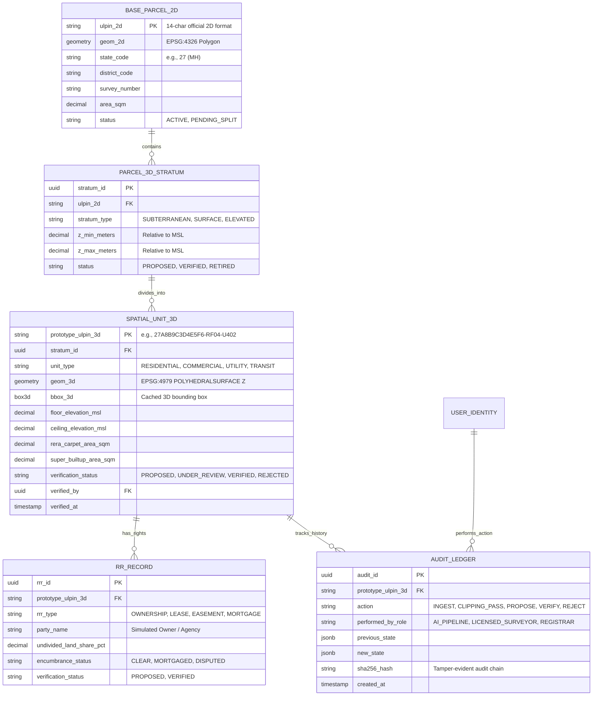
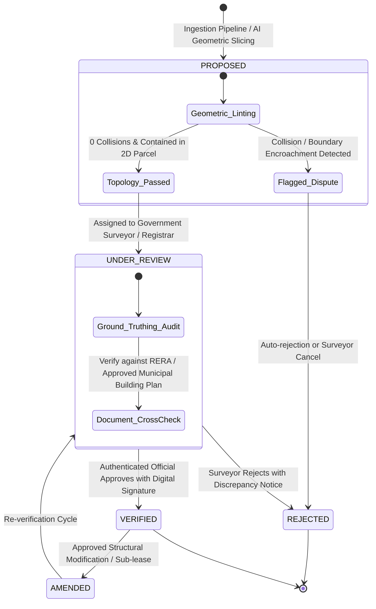
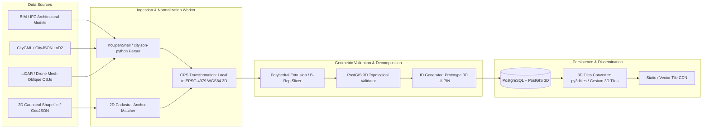
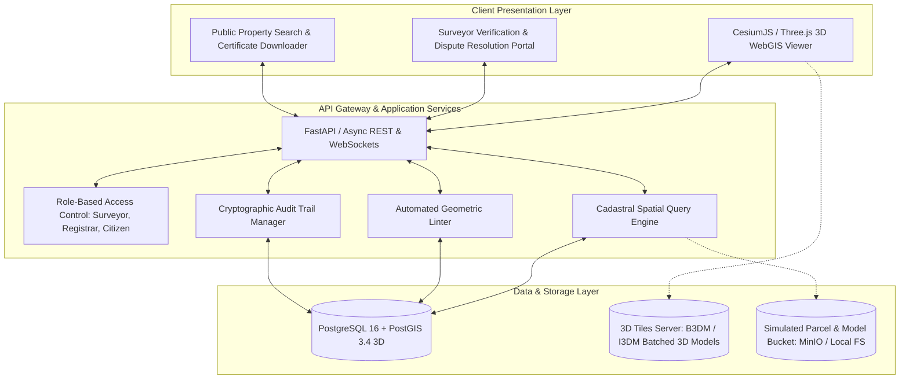

# SIH26011: 3D ULPIN Prototype System Architecture & Implementation Plan

> [!IMPORTANT]
> **LEGAL & REGULATORY RESEARCH PROTOTYPE DISCLAIMER**
> This specification describes an academic and engineering **RESEARCH PROTOTYPE** for Smart India Hackathon (SIH26011). 
> As established by the Department of Land Resources (DoLR), Ministry of Rural Development, Government of India, the official **ULPIN (Unique Land Parcel Identification Number / Bhu-Aadhaar)** is strictly a **2D, 14-digit alphanumeric parcel identifier**. 
> **No official "3D ULPIN" standard or specification currently exists in India.**
> This design neither modifies, supersedes, nor claims affiliation with the official DILRMP / Bhu-Naksha / NGDRS platforms. All integrations operate against a **simulated, self-contained cadastral dataset**.

---

## User Review Required & Scoping Flags

Before code implementation begins in subsequent phases, the following scoping decisions require user confirmation:

> [!WARNING]
> **Truncation in Prompt**: The master prompt ended abruptly at Section 1: `| **Voxel-based (X, Y, Z + height/depth)** | Discretize each...`. We have completed Section 1's comparative analysis and extrapolated the complete architectural specification across all 8 required architectural pillars (Data Model, ID Scheme, State Machine, Validation Logic, Ingestion Pipeline, System Architecture, Legal Strategy, and Scoping Questions). Please review these proposed specifications and indicate if any proprietary or specific contest requirements differ.

1. **Vertical Coordinate Reference System (CRS) & Datum**:
   - Standard 2D ULPIN uses WGS84 (EPSG:4326) geographic coordinates.
   - For vertical height ($Z$), GPS gives ellipsoidal height ($h$), whereas engineering, building plans, and flood records use orthometric height ($H$, height above Mean Sea Level / geoid datum, such as EGM2008 or Survey of India datum).
   - **Proposal**: Standardize all 3D geometries on **EPSG:4979 (3D WGS84: Lat, Long, Ellipsoidal Height in meters)** with a mandatory metadata field for **Ground Elevation Offset ($Z_{base}$) relative to MSL**.
2. **Subsurface & Aerial Boundary Extents (Public Domain vs. Private Parcel)**:
   - Indian common law historically cited *cuius est solum, eius est usque ad coelum et ad inferos* (whoever owns the soil owns up to the sky and down to the depths). However, Indian infrastructure legislation (e.g., Metro Railways Construction of Works Act, Mines and Minerals Act, Civil Aviation regulations) places statutory limits on private subterranean and supra-surface rights.
   - **Proposal**: Define standard default vertical envelope bounds ($Z_{min} = -30\text{ m}$ below ground level, $Z_{max} = +150\text{ m}$ above ground level) for private parcel strata, reserving deeper subterranean corridors (utilities, deep transit) and higher airspace for state/public volumetric units.
3. **Cadastral Geometry Level of Detail (LoD)**:
   - Should private apartments be captured as full 3D boundary polyhedra (OGC CityJSON / CityGML LoD3 with interior rooms), LoD2 (unit exterior bounding envelope / prism), or LoD1 (extruded 2.5D floor polygons with ceiling/floor elevations)?
   - **Proposal**: Target **LoD2+ (Oriented 3D Bounding Polyhedron with Floor Slab Boundaries)** for private units and utility networks, ensuring high visual clarity and performance in web viewers without the memory penalty of full BIM interior mesh detailing.

---

## 1. 3D Indexing Logic & Scheme Evaluation

We evaluate the three candidate vertical stratification approaches against the specific needs of urban multi-level land administration in India:

### Comparative Analysis Table

| Indexing Approach | Spatial Semantics | Human Readability & Legal Fit | Query Performance & Scale | Recommendation & Verdict |
| :--- | :--- | :--- | :--- | :--- |
| **1. Sequential V-ID Suffix**<br>`[14-digit ULPIN]-[Stratum-Code]`<br>*(e.g., `12345678901234-F03-U301`)* | **Low intrinsic spatial semantics** (Geometry stored entirely in relational attributes, not embedded in the string). | **Exceptional.** Matches Indian revenue record traditions (Survey No. / Sub-division / Flat No.). High acceptance for court deeds, RERA registrations, and citizen interfaces. | **High** when backed by standard R-Tree / PostGIS 3D spatial index. Queries on base parcel are $O(1)$. | **PRIMARY LEGAL & CITIZEN IDENTIFIER.** Recommended as the public-facing and cadastral registry identifier format. |
| **2. Extended H3 Hexagonal Grid (H3 + Z Layer)**<br>*(Uber H3 2D hexagon + vertical bucket)* | **Moderate-Low.** H3 produces regular hexagonal prisms. Parcels, property boundaries, and buildings are orthogonal/irregular polygons, not hexagons. | **Extremely Poor.** Hexagonal cells slice across building walls, apartment units, and parcel boundary lines, creating complex boundary disputes and fractional ownership artifacts. | **Very High** for multi-resolution city-scale spatial aggregation, heatmaps, and spatial caching. | **REJECT for Cadastral Identification.** Retain solely for internal spatial analytics, city-scale point-in-polygon caching, or multi-resolution visualization. |
| **3. Voxel-Based Discretization (Octree / 3D Grid)**<br>*(Discretize into regular 3D bounding cubes, e.g., $1\text{m}^3$)* | **High volumetric semantics**, but discretizes smooth architectural walls into stepped stair-step voxels unless resolution is extremely fine. | **Poor.** Abstract binary/octree hashes (e.g., 3D Morten codes) are unreadable by registrars, banks, surveyors, and citizens. Huge storage overhead ($O(n^3)$). | **Moderate.** Excellent for boolean collision detection (CSG), but inefficient for legal boundary querying and cadastral land parcel registration. | **REJECT as primary format.** Voxelization is unsuitable for legal rights demarcation; architectural boundary representation (B-Rep) is required by international cadastral standards. |

### Recommended Architecture: Dual-Layer Hybrid Indexing Scheme

We recommend a **Dual-Layer Cadastral Architecture**:
1. **Legal & Administrative Layer**: **Hierarchical Semantic Suffix on 2D ULPIN** (Human-readable, RERA-compatible, legal-grade).
2. **Spatial Engine & Computing Layer**: **PostGIS 3D Polyhedral Boundary Representation (B-Rep)** with **3D Bounding Box R-Tree (`GIST`) indexing**, complemented by an internal **Spatial Morton Code / 3D Tile Bounding Volume Hierarchy (BVH)** for OGC 3D Tiles web streaming.

---

## 2. Prototype 3D ULPIN Identifier Scheme Specification

### Formal Grammar & Structure

```
Format:
{2D_ULPIN}-{STRATUM_CLASS}{VERTICAL_TIER}-{UNIT_IDENTIFIER}

Example Instances:
Base 2D Parcel ULPIN:          27A8B9C3D4E5F6
Residential Apartment (Fl 4):   27A8B9C3D4E5F6-RF04-U402
Basement Parking Level 2:       27A8B9C3D4E5F6-SB02-P114
Subsurface Water Trunk Line:    27A8B9C3D4E5F6-UT01-WTR09
Elevated Metro Transit Corridor:27A8B9C3D4E5F6-AE01-MTR01
Rooftop Solar Lease / Air Right:27A8B9C3D4E5F6-AR01-SLR03
```

### Component Breakdown

1. **Base 2D ULPIN** (14 Alphanumeric characters): Inherited directly from the underlying simulated terrestrial cadastral parcel.
2. **Separator**: Hyphen (`-`) for clean parsing and regex tokenization.
3. **Stratum Classification Code** (2 Characters):
   - `SB`: Subsurface Basement / Vault
   - `UT`: Underground Utility Corridor (Water, Sewage, Power, Gas, Fiber)
   - `RF`: Residential Floor Unit
   - `CF`: Commercial Floor Unit
   - `MF`: Mixed-Use Unit
   - `AE`: Aerial Elevated Infrastructure (Flyover, Metro, Skywalk)
   - `AR`: Air Rights / Rooftop Installation
   - `CM`: Common Area / Undivided Share of Land (Circulation, Lift, Lobby)
4. **Vertical Tier Code** (2 Digits):
   - `B1`–`B9`: Subterranean levels below ground
   - `F0`–`F99`: Above-ground floor levels (`F00` = Ground floor)
   - `01`–`99`: General sequence index for utilities or aerial spans
5. **Unit Identifier** (Up to 6 Alphanumeric characters):
   - Specific flat/unit, parking stall, or utility segment tag (e.g., `U402`, `P114`, `WTR09`).

---

## 3. Data Model & Database Architecture (ISO 19152 LADM Aligned)

The data model conforms to the **ISO 19152 Land Administration Domain Model (LADM)** international standard for 3D Cadastres, extended for Indian land tenure realities (including RERA Carpet Area and Undivided Share of Land).



---

## 4. State Machine & Human-in-the-Loop Governance

Per **Hard Constraint #3**, ownership and spatial validity are never established automatically by AI algorithms or batch import scripts. All newly derived 3D spatial units enter the system in a locked state.



### State Definitions & Transition Rules

1. `PROPOSED`:
   - Generated by BIM/IFC parser, CityJSON importer, or LiDAR extraction.
   - Read-only in public viewer; explicitly badged as `[UNVERIFIED RESEARCH PROTOTYPE]`.
   - Cannot be linked to title transfers, property taxes, or utility connections.
2. `UNDER_REVIEW`:
   - Assigned to a designated human role (e.g., `GOVT_SURVEYOR`, `TOWN_PLANNER`, `REGISTRAR`).
   - Requires verification against the municipal Sanctioned Building Plan and RERA approval certificate.
3. `VERIFIED`:
   - Achieved **only** when an authenticated official submits a signed verification transaction.
   - Triggers entry into the tamper-evident `AUDIT_LEDGER`.
4. `REJECTED`:
   - Assigned when geometric overlap, illegal encroachment, or missing documentation is discovered.
   - Unit is retained for historical record but disabled from active cadastre views.

---

## 5. Geometric & Topological Validation Engine

A 3D spatial cadastre requires mathematical rigor to prevent overlapping claims ("phantom volume sales") and illegal encroachments into public airspace or utilities.

```mermaid
flowchart TD
    A[New 3D Unit Geometry (IFC / CityJSON / Mesh)] --> B{Rule 1: 2D Footprint Containment}
    B -- Exceeds 2D Parcel Footprint without Easement --> B1[FLAG: Cantilever / Boundary Encroachment Dispute]
    B -- Within Base Parcel Boundary --> C{Rule 2: Vertical Interval & Elevation Bounds}
    
    C -- Floor >= Ceiling or Inverted Z --> C1[REJECT: Inverted Vertical Topology]
    C -- Valid Z-Extents --> D{Rule 3: 3D Volumetric Collision Check}
    
    D -- PostGIS 3D Intersection ST_3DIntersects > 0 --> D1[FLAG: Volumetric Overlap / Multiple Claims]
    D -- No Collision with Existing Units --> E{Rule 4: Common Area & Circulation Access}
    
    E -- Isolated Volume with No Access Corridor --> E1[WARN: Trapped Unit / Missing Access Easement]
    E -- Valid Access Topology --> F[PASS: Promote to PROPOSED State in DB]
    
    B1 --> G[Log to Anomaly Ledger & Quarantine]
    C1 --> G
    D1 --> G
    E1 --> F
```

### Mathematical Validation Rules in PostGIS 3D

1. **Horizontal Parcel Footprint Containment**:
   $$\text{ST\_Within}(\text{ST\_Force2D}(\text{geom\_3d}), \text{base\_parcel\_2d.geom\_2d}) = \text{TRUE}$$
   *(Exceptions allowed only if flagged as registered Cantilever / Air Rights with adjacent parcel aerial easement).*
2. **3D Collision Disjointness**:
   For any new unit $U_{new}$ and existing unit $U_{existing}$:
   $$\text{ST\_3DIntersects}(U_{new}.\text{geom\_3d}, U_{existing}.\text{geom\_3d}) = \text{FALSE}$$
   $$\text{ST\_Volume}(\text{ST\_3DIntersection}(U_{new}.\text{geom\_3d}, U_{existing}.\text{geom\_3d})) = 0$$
3. **Planar Boundary Closure (2-Manifold Solid)**:
   Every 3D unit volume must be a closed, watertight polyhedral surface conforming to ISO 19107:
   $$\text{ST\_IsClosed}(\text{geom\_3d}) = \text{TRUE} \quad \wedge \quad \text{ST\_IsSolid}(\text{geom\_3d}) = \text{TRUE}$$

---

## 6. Ingestion & Transformation Pipeline



---

## 7. System Architecture & Tech Stack



### Component Technology Choices
- **Database**: PostgreSQL 16 + PostGIS 3.4 (with SFCGAL enabled for true 3D polyhedral geometries `CG_3DIntersection`, `ST_3DVolume`).
- **Backend API**: Python 3.11 + FastAPI + GeoAlchemy2 + Pydantic v2.
- **Frontend 3D Visualizer**: Vite + React + CesiumJS (for high-precision WGS84 globes and OGC 3D Tiles) or Three.js (for isolated building inspection).
- **Ingestion Tools**: `ifcopenshell` (IFC parsing), `cjio` (CityJSON processing), `pyproj` (3D CRS re-projection), `shapely` / `trimesh` (mesh validation).

---

## 8. Legal, Regulatory & Coexistence Strategy

To ensure credibility before evaluators and government stakeholders, the system adopts a strict coexistence posture:

1. **Coexistence with 2D ULPIN (Bhu-Aadhaar)**:
   - The 2D ULPIN remains the inviolable root of title. A 3D ULPIN cannot exist without an active parent 2D ULPIN.
   - If a 2D parcel is mutated (split, amalgamated), all attached 3D units transition to `PENDING_REVALIDATION`.
2. **Alignment with Real Estate (Regulation and Development) Act, 2016 (RERA)**:
   - The 3D unit schema explicitly isolates **RERA Carpet Area** (internal usable area) from common circulation areas.
   - Eliminates builder-buyer disputes over "super built-up area" inflation by providing an unambiguous 3D spatial boundary.
3. **Apartment Ownership Acts & Undivided Share of Land (USL)**:
   - Vertical units in an apartment complex own an **Undivided Share of Land** in the parent 2D parcel. The system links all unit records to a computed USL percentage, enforcing that $\sum \text{USL} = 100\%$.
4. **Subsurface Utility & Aerial Transit Easements**:
   - For underground metros or elevated flyovers passing across multiple parcels, the system models **Linear 3D Volumetric Easements** that cross 2D parcel boundaries without altering 2D terrestrial surface ownership.

---

## Verification Plan

### Automated Tests
- **Schema & Migration Tests**: Verify PostgreSQL table creation with 3D geometries (`POLYHEDRALSURFACE Z`) and GIST spatial indices.
- **Unit Linter Tests**: Test regex validation and parsing of the Prototype 3D ULPIN syntax.
- **Topological Integrity Tests**: Test PostGIS spatial query scripts verifying:
  - 3D collision detection between overlapping mock apartment units.
  - Footprint containment check against base 2D polygon.
  - Elevation consistency check ($Z_{min} < Z_{max}$).
- **State Machine Rules**: Verify that unauthenticated requests or AI scripts cannot transition records directly to `VERIFIED`.

### Manual & Visual Verification
- Visual inspection of the simulated multi-storey building, underground utility line, and elevated metro corridor loaded into the 3D viewer.
- Verification of prominent research prototype notices across UI, API responses, and generated documents.
